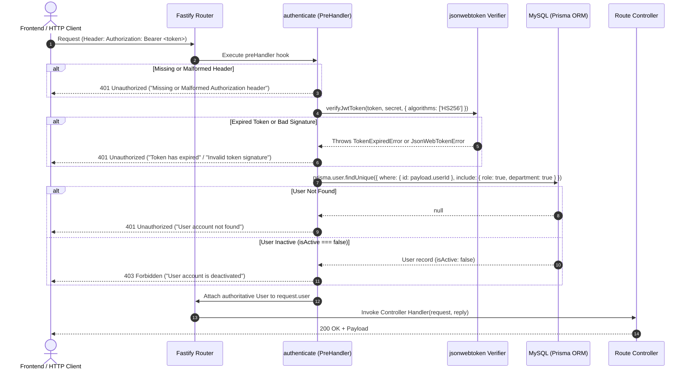

# Step 02: Backend Authentication Security Assessment & Implementation Report

> **Notice:** This document records the technical implementation and verification performed in Step 2 (Backend Authentication Security). This report does **NOT** claim HIPAA compliance or certification; it documents concrete security controls, testing outcomes, and remaining system limitations.

---

## 1. Overview & Objectives

In accordance with Step 2 directives, backend authentication was overhauled from an ad-hoc, partially unprotected configuration into a **centralized, fail-closed authentication architecture**. 

### Primary Objectives Accomplished:
1. **Centralized PreHandler Hook:** Implemented [`authenticate`](file:///i:/spine-brain-project/Spine-Brain-backend/src/middlewares/auth.middleware.ts) middleware for Fastify.
2. **Authoritative Identity Resolution:** All requests resolve user identity and permissions exclusively through real MySQL database lookups (`prisma.user.findUnique`), strictly disallowing reliance on client-submitted role or permission claims.
3. **Fail-Closed Secrets:** Eliminated hardcoded fallback JWT secrets (`supersecretkey123`). The application crashes immediately on startup if `JWT_SECRET` is missing.
4. **Comprehensive Route Protection:** Enforced `authenticate` across all sensitive domain endpoints, while explicitly documenting intentionally public endpoints.
5. **Anti-Enumeration & Inactive Account Controls:** Standardized generic error responses on login to prevent user enumeration and enforced `isActive` checks.
6. **Automated Verification:** Implemented and executed an end-to-end automated test suite ([`test_auth_security.ts`](file:///i:/spine-brain-project/Spine-Brain-backend/test_auth_security.ts)) against the live MySQL database, passing 41 test cases.

---

## 2. Files Changed & Added

| File Path | Action | Description |
|---|---|---|
| [`Spine-Brain-backend/src/middlewares/auth.middleware.ts`](file:///i:/spine-brain-project/Spine-Brain-backend/src/middlewares/auth.middleware.ts) | **NEW** | Centralized Fastify authentication middleware, JWT verifier, fail-closed environment secret checker, request context type augmentation (`request.user`), and active account enforcer. |
| [`Spine-Brain-backend/src/services/auth.service.ts`](file:///i:/spine-brain-project/Spine-Brain-backend/src/services/auth.service.ts) | **MODIFIED** | Switched to `getJwtSecret()`, unified login error responses against user enumeration, and added `isActive` checks. |
| [`Spine-Brain-backend/src/controllers/auth.controller.ts`](file:///i:/spine-brain-project/Spine-Brain-backend/src/controllers/auth.controller.ts) | **MODIFIED** | Removed fallback `JWT_SECRET` and manual token parsing in `getCurrentUserHandler`; now consumes authoritative `request.user` decorated by middleware. |
| [`Spine-Brain-backend/src/routes/auth.routes.ts`](file:///i:/spine-brain-project/Spine-Brain-backend/src/routes/auth.routes.ts) | **MODIFIED** | Bound `preHandler: [authenticate]` to `/me`. Kept `/login` intentionally public. |
| [`Spine-Brain-backend/src/server.ts`](file:///i:/spine-brain-project/Spine-Brain-backend/src/server.ts) | **MODIFIED** | Added startup validation check calling `getJwtSecret()` to fail fast before binding network listener. |
| [`Spine-Brain-backend/.env`](file:///i:/spine-brain-project/Spine-Brain-backend/.env) | **MODIFIED** | Added cryptographically strong 256-bit `JWT_SECRET` and `JWT_EXPIRES_IN`. |
| [`Spine-Brain-backend/src/routes/dashboard.routes.ts`](file:///i:/spine-brain-project/Spine-Brain-backend/src/routes/dashboard.routes.ts) | **MODIFIED** | Enforced scoped `authenticate` preHandler across dashboard endpoints. |
| [`Spine-Brain-backend/src/routes/users.routes.ts`](file:///i:/spine-brain-project/Spine-Brain-backend/src/routes/users.routes.ts) | **MODIFIED** | Enforced scoped `authenticate` preHandler across all user management routes. |
| [`Spine-Brain-backend/src/routes/campaigns.routes.ts`](file:///i:/spine-brain-project/Spine-Brain-backend/src/routes/campaigns.routes.ts) | **MODIFIED** | Enforced scoped `authenticate` preHandler across campaign routes. |
| [`Spine-Brain-backend/src/routes/budget.routes.ts`](file:///i:/spine-brain-project/Spine-Brain-backend/src/routes/budget.routes.ts) | **MODIFIED** | Enforced scoped `authenticate` preHandler across budget routes. |
| [`Spine-Brain-backend/src/routes/vendors.routes.ts`](file:///i:/spine-brain-project/Spine-Brain-backend/src/routes/vendors.routes.ts) | **MODIFIED** | Enforced scoped `authenticate` preHandler across vendor routes. |
| [`Spine-Brain-backend/src/routes/analytics.routes.ts`](file:///i:/spine-brain-project/Spine-Brain-backend/src/routes/analytics.routes.ts) | **MODIFIED** | Enforced scoped `authenticate` preHandler across analytics routes. |
| [`Spine-Brain-backend/src/routes/settings.routes.ts`](file:///i:/spine-brain-project/Spine-Brain-backend/src/routes/settings.routes.ts) | **MODIFIED** | Enforced scoped `authenticate` preHandler across organization settings routes. |
| [`Spine-Brain-backend/src/routes/reports.routes.ts`](file:///i:/spine-brain-project/Spine-Brain-backend/src/routes/reports.routes.ts) | **MODIFIED** | Enforced scoped `authenticate` preHandler across report generation and export routes. |
| [`Spine-Brain-backend/src/routes/rbac.routes.ts`](file:///i:/spine-brain-project/Spine-Brain-backend/src/routes/rbac.routes.ts) | **MODIFIED** | Enforced scoped `authenticate` preHandler across role management routes. |
| [`Spine-Brain-backend/src/routes/form-submissions.routes.ts`](file:///i:/spine-brain-project/Spine-Brain-backend/src/routes/form-submissions.routes.ts) | **MODIFIED** | Enforced scoped `authenticate` preHandler across patient form submissions. |
| [`Spine-Brain-backend/src/routes/integrations.routes.ts`](file:///i:/spine-brain-project/Spine-Brain-backend/src/routes/integrations.routes.ts) | **MODIFIED** | Enforced scoped `authenticate` preHandler across third-party integration routes. |
| [`Spine-Brain-backend/src/routes/leads.routes.ts`](file:///i:/spine-brain-project/Spine-Brain-backend/src/routes/leads.routes.ts) | **MODIFIED** | Enforced `preHandler: [authenticate]` on `GET /` (patient leads) while preserving `POST /webhook`. |
| [`Spine-Brain-backend/src/routes/calls.routes.ts`](file:///i:/spine-brain-project/Spine-Brain-backend/src/routes/calls.routes.ts) | **MODIFIED** | Enforced `preHandler: [authenticate]` on `GET /` (call logs) while preserving `POST /webhook`. |
| [`Spine-Brain-backend/src/routes/reputation.routes.ts`](file:///i:/spine-brain-project/Spine-Brain-backend/src/routes/reputation.routes.ts) | **MODIFIED** | Enforced `authenticate` across all review management and GBP endpoints while preserving `POST /reviews` webhook. |
| [`Spine-Brain-backend/src/routes/google-oauth.routes.ts`](file:///i:/spine-brain-project/Spine-Brain-backend/src/routes/google-oauth.routes.ts) | **MODIFIED** | Enforced `authenticate` on OAuth initiation (`/start`) and GA4 reports while preserving public OAuth callback (`/callback`). |
| [`Spine-Brain-backend/test_auth_security.ts`](file:///i:/spine-brain-project/Spine-Brain-backend/test_auth_security.ts) | **NEW** | Automated test suite validating 41 security assertions. |

---

## 3. Architecture & Authentication Flow



---

## 4. Security Decisions

1. **Fail-Closed Secret Enforcement (`getJwtSecret`):**
   - Fallback defaults (e.g. `|| 'supersecretkey123'`) are completely removed.
   - If `JWT_SECRET` is unset or blank in `.env` / environment, the application throws a fatal configuration error during startup and crashes immediately with exit code 1.

2. **Authoritative Server-Side User Loading:**
   - Any claims provided inside the JWT (such as `role: "Admin"`) are strictly ignored for authorization.
   - The middleware uses `payload.userId` to query the live MySQL database, obtaining the current `roleName`, `permissions`, `isActive` status, and `departmentId`.

3. **Protection Against User Enumeration:**
   - On `POST /api/v1/auth/login`, non-existent emails, disabled accounts, and incorrect passwords all return the exact same error response: `401 Unauthorized: "Invalid email or password"`.

4. **Public vs. Protected Route Categorization:**
   Every route in the backend was audited and categorized. Protected routes now reject unauthenticated access with `401 Unauthorized`.

---

## 5. Intentionally Public Endpoints Registry

The following endpoints remain accessible without a Bearer JWT:

| Endpoint | Method | Purpose | Authentication / Protection Mechanism |
|---|---|---|---|
| `/api/health` | `GET` | System health check and uptime monitoring. | Open |
| `/api/v1/auth/login` | `POST` | User credential authentication. | Public endpoint with Zod schema validation & bcrypt verification. |
| `/api/v1/integrations/google/oauth/callback` | `GET` | Google OAuth redirect callback. | Uses short-lived state token verification (`stateStore`). |
| `/api/v1/webhooks/wordpress/forms` | `POST` | Inbound form submissions from WordPress. | Rate-limited + `WORDPRESS_FORM_WEBHOOK_SECRET` header check. |
| `/api/v1/webhooks/google-reviews` | `POST` | Inbound GBP Google Review webhooks. | GCP PubSub webhook verification. |
| `/api/v1/leads/webhook` | `POST` | Inbound lead ingestion from external ad forms. | Zod schema validation. |
| `/api/v1/calls/webhook` | `POST` | Inbound CallRail call tracking logs. | Zod schema validation. |
| `/api/v1/reputation/reviews` | `POST` | External patient review submission. | Checked via `x-webhook-secret` header verification. |

---

## 6. Automated Testing Performed

An automated test suite was constructed in [`test_auth_security.ts`](file:///i:/spine-brain-project/Spine-Brain-backend/test_auth_security.ts) utilizing Fastify's native `app.inject()` and real database connectivity.

### Test Groups Executed:
1. **Group 1: Token Rejection & Boundary Conditions**
   - Missing `Authorization` header -> `401 Unauthorized`
   - Non-Bearer scheme (`Basic ...`) -> `401 Unauthorized`
   - Malformed JWT string (`invalid.jwt.string`) -> `401 Unauthorized`
   - Expired JWT (`exp` in the past) -> `401 Unauthorized`
   - Invalid signature (signed with an untrusted secret) -> `401 Unauthorized`
   - Valid JWT structure but non-existent user ID -> `401 Unauthorized`
2. **Group 2: Authoritative Database User Context**
   - Valid token on `/api/v1/auth/me` -> `200 OK` with database profile
   - Forged role claim in token -> Server ignores client role and populates database role
3. **Group 3: Domain Endpoints Access Control (14 Protected Endpoints Tested)**
   - Unauthenticated access returns `401 Unauthorized`
   - Authenticated access returns `200 OK`
   - Evaluated routes: `/users`, `/roles`, `/dashboard/summary`, `/campaigns`, `/budget/overview`, `/vendors`, `/analytics/overview`, `/reputation/reviews`, `/settings/organization`, `/reports/exports`, `/integrations/status`, `/leads`, `/calls`, `/form-submissions`.
4. **Group 4: Intentionally Public Endpoints**
   - Health check `/api/health` -> `200 OK`
   - Login `/api/v1/auth/login` -> `401` on invalid credentials
   - Google OAuth Callback `/api/v1/integrations/google/oauth/callback` -> Reached publicly
5. **Group 5: Real User Login Verification**
   - Real database user authenticated via `POST /api/v1/auth/login`, issuing a valid JWT
   - Newly issued token immediately verified on `GET /api/v1/auth/me`

---

## 7. Test Results Summary

```text
====================================================
  AUTHENTICATION TEST RESULTS: 41 PASSED, 0 FAILED
====================================================
```

- **TypeScript Compilation:** `npx tsc --noEmit` passed with 0 errors.
- **Prisma Schema Validation:** `npx prisma validate` passed successfully.
- **Real Database Integrity:** Zero fake test users created, zero schema migrations applied, zero existing records modified.

---

## 8. Remaining Authentication Limitations (For Subsequent Steps)

1. **Stateless JWT Revocation / Session Tracking:**
   - JWT tokens currently remain valid until their expiration timestamp (`JWT_EXPIRES_IN`, default 1 day) unless the user's record is deactivated in the database (`isActive: false`).
   - Immediate logout invalidation requires introducing a token blacklist or server-managed session table in a subsequent security step.
2. **Role-Based Access Control (RBAC):**
   - All authenticated active users can currently access protected endpoints. Enforcing resource-level and role-level permission guards (e.g. `requirePermission('users:manage')`) is scheduled for Step 3.
3. **Frontend Token Storage:**
   - The frontend currently stores tokens in `localStorage`. Moving to `httpOnly` secure cookies or memory-stored access tokens with refresh rotation will be addressed during frontend hardening.
