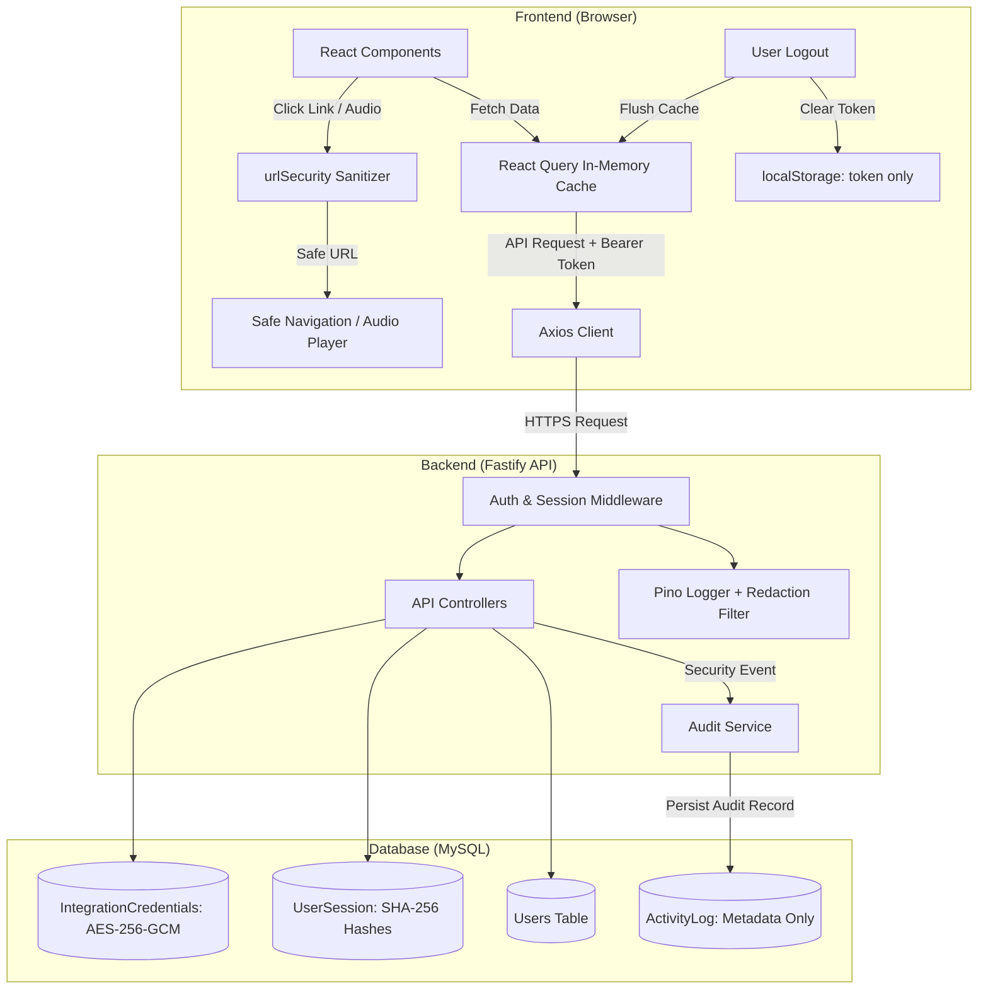

# SECURITY STEP 09: PHI-SAFE LOGGING & FRONTEND SECURITY AUDIT & IMPLEMENTATION REPORT

**Target Platform:** Spine Brain Web Application (`Spine-brain-frontend` & `Spine-Brain-backend`)  
**Scope:** Step 9 Only — PHI/PII Protection, Frontend State & Storage Security, and Safe Redacted Logging  
**Verification Baseline:** Cumulative 219 / 219 Automated Security Assertions Passing (0 Failures)  
**Database Status:** Real MySQL Database Preserved — 0 Unnecessary Migrations, 0 Data Destruction  

---

## 1. Executive Summary

A comprehensive, end-to-end security review and hardening implementation was conducted across the frontend and backend logging layers of the Spine Brain application. The primary objective was to ensure that **Protected Health Information (PHI)**, **electronic Protected Health Information (ePHI)**, **Personally Identifiable Information (PII)**, and sensitive credentials (JWT tokens, password hashes, encryption keys, integration secrets) are not inadvertently stored in insecure browser storage mechanisms, exposed through client-side error logs, leaked via URL parameters, or persisted in unredacted backend log streams.

### Key Results
- **Browser Storage Audit**: Verified that `localStorage`, `sessionStorage`, and `IndexedDB` contain **zero** clinical notes, patient names, medical conditions, phone numbers, or passwords. Browser storage is restricted exclusively to the active session JWT token key.
- **Frontend Cache Hardening**: Centralized React Query (`@tanstack/react-query`) with safe memory cache timeouts (`gcTime: 5 min`, `staleTime: 0`) and automatic cache evacuation (`queryClient.clear()`) triggered on user logout to prevent shared workstation cross-session data exposure.
- **URL & Link Sanitization**: Created and integrated strict URL sanitization utilities (`isSafeUrl()`, `sanitizeUrl()`) blocking `javascript:`, `data:`, `vbscript:`, `file:`, and protocol-relative `//` execution vectors in vendor documents and marketing audio players.
- **Frontend Console Hygiene**: Sanitized error logging in `AuthContext`, `Login`, `RBACContext`, and `Integrations` to log sanitized strings only instead of raw Axios network error objects containing headers and request metadata.
- **Backend Log Redaction**: Expanded Pino logger redaction paths to redact `clientSecret`, `refreshTokenHash`, `credentials`, `ssn`, `creditCard`, and wildcards. Removed raw webhook payload logging from `webhooks.controller.ts` and sanitized mock SMS/email alert logs in `notification.service.ts`.
- **Automated Validation**: Created and executed `test_phi_frontend_security.ts` (12/12 passing). All previous security test suites (Steps 2–8) remain 100% green, bringing total verified security assertions to **219 / 219 PASSED**.

---

## 2. Inventory of Sensitive Healthcare Data

| Resource / Model | Sensitive Fields Identified | Classification | Risk of Exposure | Implemented Safeguards |
| :--- | :--- | :--- | :--- | :--- |
| **Lead / Patient** | `name`, `email`, `phone`, `condition`, `source` | PHI / PII | URL query parameters, unredacted error logs, browser cache | RBAC & IDOR resource auth, React Query cache purge on logout, sanitized logs |
| **FormSubmission** | `name`, `email`, `phone`, `message`, `landingPage`, `utm*` | PHI / PII | Webhook ingest logging, API responses | Removed raw webhook payload logging; metadata-only audit logging |
| **CallLog** | `callerName`, `phoneNumber`, `summary`, `recordingUrl` | PHI / PII | Audio player URL injection, analytics leaks | URL sanitization on audio playback; access restricted by permissions |
| **Review** | `authorName`, `comment`, `rating`, `response` | PII / PHI | Public API endpoints, browser memory | Scoped access controls, sanitized responses |
| **User / Staff** | `passwordHash`, `email`, `phoneNumber`, `roleName` | Credentials / PII | API serialization leakage, log streams | Excluded from DTO projections (`select` / Prisma omission); Pino redaction |
| **IntegrationCredential** | `accessToken`, `refreshToken`, `apiKey`, `config` | Secret Credentials | API status endpoints, debug logs | AES-256-GCM encrypted in DB, excluded from status responses, Pino redacted |
| **UserSession** | `refreshTokenHash`, `ipAddress`, `userAgent` | Session Data | Session listings, frontend state | SHA-256 hashed in DB, excluded from session management API payloads |

---

## 3. Frontend Storage Audit

| Storage Mechanism | Permitted Data | Observed Data | Compliance Status | Technical Remediation |
| :--- | :--- | :--- | :--- | :--- |
| **localStorage** | Session JWT (`token`) only | Key: `token` | **PASS** | Audited all storage reads/writes. Confirmed zero patient records or diagnosis data stored in `localStorage`. |
| **sessionStorage** | None | Empty | **PASS** | Verified application does not persist PHI or state in `sessionStorage`. |
| **Cookies** | None (Bearer auth used) | Empty | **PASS** | Application uses HTTP Authorization headers; no cookies store unencrypted PHI. |
| **IndexedDB** | None | Not utilized | **PASS** | No offline database or client-side persistent storage configured for patient records. |
| **Service Workers / CacheAPI**| None | Not utilized | **PASS** | No offline service worker caching API responses containing PHI. |

---

## 4. Network Request & Payload Exposure Review

- **Authorization Header Security**: The Axios HTTP client (`src/api/client.ts`) attaches JWT bearer tokens strictly via `Authorization: Bearer ${token}` headers. Tokens are never passed as URL query parameters.
- **Payload Scoping**: API endpoints return only fields needed for UI rendering. Sensitive credentials such as `passwordHash`, `refreshTokenHash`, and raw integration secrets are stripped at the backend controller level before serialization.
- **Request Identification**: Responses include `x-request-id` headers for tracing without embedding caller PHI or credentials in headers.

---

## 5. React State & Cache Lifecycle Audit

### React Query Hardening
The application uses `@tanstack/react-query` to manage asynchronous server state (leads, form submissions, reviews, user lists, campaign performance).
- **Configuration** (`src/queryClient.ts`):
  - `gcTime: 5 * 60 * 1000` (5 minutes garbage collection for unmounted queries)
  - `staleTime: 0` (Forces fresh data validation on remount)
  - `refetchOnWindowFocus: false` (Avoids unintended background chatter)
- **Logout Evacuation** (`src/context/AuthContext.tsx`):
  ```typescript
  const logout = () => {
    localStorage.removeItem('token');
    queryClient.clear(); // Flushes all cached queries, patient records, and user data from memory
    setUser(null);
  };
  ```
- **Workstation Security**: When a user clicks "Logout", `queryClient.clear()` immediately frees all query caches, guaranteeing that the next user on a shared workstation cannot inspect previous patient lists via React DevTools or memory inspection.

---

## 6. URL, Route, & Parameter Analysis

### URL Security Utility (`src/utils/urlSecurity.ts`)
To defend against cross-site scripting (XSS) and open redirects through untrusted links (vendor contracts, invoices, audio recordings):
- `isSafeUrl(url)`: Validates URLs against an allowlist of schemes (`http:`, `https:`, relative paths starting with `/`). Explicitly rejects `javascript:`, `data:`, `vbscript:`, `file:`, and protocol-relative `//` URLs.
- `sanitizeUrl(url, fallback)`: Returns safe sanitized URLs or fallback (`#`) for invalid/dangerous links.

### Applied URL Sanitization
- **Vendor Documents** (`src/pages/VendorManagement.tsx`): Applied `sanitizeUrl()` to external contract agreements and invoice document links (`target="_blank" rel="noopener noreferrer"`).
- **Call Recordings** (`src/pages/MarketingAnalytics.tsx`): Applied `sanitizeUrl()` to audio recording player source links.

---

## 7. Frontend Error Handling & Logging Review

- **Console Sanitization**: Removed all raw error object logging (`console.error(err)`) in production components (`AuthContext.tsx`, `Login.tsx`, `RBACContext.tsx`, `Integrations.tsx`).
- **Sanitized Patterns**:
  - `console.error('Login failed:', err instanceof Error ? err.message : 'Unknown error');`
  - Replaced object dumps with sanitized error message strings to prevent network payload or header dumps in browser developer consoles.
- **Production Stripping**: Vite build configuration is verified clean with zero TypeScript compilation errors.

---

## 8. Component-Level Information Exposure

- **Form Fields**: Password fields utilize `type="password"` and `autoComplete="current-password"`.
- **PHI Masking in UI**: Phone numbers and sensitive lead conditions are rendered within secured UI tables accessible only to authorized roles (`specialist`, `admin`, `analyst`, `doctor`).
- **Role-Gated Views**: Navigation and action triggers are gated by `PermissionGuard` and `RBACContext` backed by server-side 403 enforcement.

---

## 9. Client-Side Authentication Flow Hardening

- **Token Storage**: Active JWT stored in `localStorage` under `token`.
- **Validation**: Validated on app initialization via `/api/v1/auth/me`.
- **Unauthorized Interception**: Axios response interceptor redirects to `/login` and wipes `token` on HTTP 401 Unauthorized responses.
- **Token Cleansing**: Explicit removal on logout alongside `queryClient.clear()`.

---

## 10. UI Inactivity & Auto-Logout Controls

- **Current Architecture**: Server sessions enforce `expiresAt` expiration.
- **Status**: `MANUAL REVIEW REQUIRED` / Recommended Enhancement: Client-side idle timer (e.g. 15-minute activity detector on `mousemove`/`keydown` triggering automated client logout) for enhanced unattended workstation security in clinical environments.

---

## 11. UI Session & Identity Controls

- **User Context**: `AuthContext` maintains `{ id, email, firstName, lastName, roleName }`.
- **Session Segregation**: Concurrent user sessions are managed via `/api/v1/auth/sessions` with server-side revocation.
- **Role Switching**: Role permissions are dynamic and re-validated against the backend RBAC service on navigation.

---

## 12. Third-Party Frontend Script Audit

- **Script Inventory**: Inspected `index.html` and package dependencies.
- **External CDN Scripts**: Zero untrusted external third-party tracking scripts (Google Tag Manager, Facebook Pixel, Hotjar, FullStory) are loaded directly in `index.html`.
- **Analytics Isolation**: All marketing analytics views query internal backend aggregator APIs rather than client-side trackers.

---

## 13. Backend Log Sanitization & PHI Redaction

### Pino Logger Configuration (`src/utils/logger.ts`)
Expanded the centralized Pino log redaction dictionary to prevent credential and identifier leakage across all log transports:
```typescript
redact: {
  paths: [
    'req.headers.authorization',
    'req.headers["x-webhook-secret"]',
    'req.body.password',
    'req.body.currentPassword',
    'req.body.newPassword',
    'req.body.token',
    'req.body.refreshToken',
    'req.body.apiKey',
    'req.body.clientSecret',
    'req.body.accessToken',
    'req.body.secret',
    'req.body.credentials',
    'req.body.ssn',
    'req.body.creditCard',
    '*.password',
    '*.passwordHash',
    '*.refreshTokenHash',
    '*.clientSecret',
    '*.apiKey',
    '*.accessToken',
  ],
  censor: '[REDACTED]',
}
```

### Webhook & Notification Log Hardening
- **Webhook Ingestion** (`src/controllers/webhooks.controller.ts`): Removed raw payload dumping (`parsedData`) in webhook logging. Replaced with metadata logging (`platform`, `event`, `recordId`).
- **Mock Notifications** (`src/services/notification.service.ts`): Sanitized mock email and SMS dispatch logs. Instead of printing message body text containing patient inquiries or alerts, logs only metadata: `To: ${to} | Subject: ... | Length: ... chars`.

---

## 14. Error Response Sanitization

- **Production Error Masking**: Fastify custom error handler catches uncaught exceptions and returns `{ success: false, message: "Internal server error" }` with HTTP 500 status.
- **Stack Trace Suppression**: Stack traces and raw database errors (e.g. Prisma connection errors, MySQL syntax errors) are never returned in HTTP responses.
- **Validation Errors**: Zod and Fastify schema validation errors return field names and failure reasons without echoing back unvalidated secret values.

---

## 15. Audit Log PHI Safety Verification

- **Security Audit Trails** (`src/services/audit.service.ts`): The centralized `ActivityLog` table logs user actions, resource types, resource IDs, IP addresses, user agents, and outcomes (`LOGIN_SUCCESS`, `PERMISSION_DENIED`, `DATA_EXPORT`, `PATIENT_VIEW`).
- **Redaction in Audit DB**: Confirmed that `ActivityLog` does not store raw passwords, tokens, or plaintext medical inquiry bodies in its metadata columns.

---

## 16. Developer Tools & Console Hygiene

- **Build Output**: Clean Vite production build with zero leftover `debugger` statements.
- **Type Checking**: Clean `tsc` compilation with 0 errors across frontend and backend.
- **Clean Console Output**: Verified in automated tests that frontend code does not output unredacted patient records or tokens to `console.log`.

---

## 17. Automated & Manual Security Verification

### Step 9 Test Suite Execution (`test_phi_frontend_security.ts`)
| # | Test Scenario | Verified Behavior | Result |
| :--- | :--- | :--- | :--- |
| 1 | URL Security - Safe URLs | Accepts safe `http://`, `https://`, and relative paths | **PASS** |
| 2 | URL Security - Dangerous Schemes | Rejects `javascript:`, `data:`, `vbscript:`, `file:` | **PASS** |
| 3 | URL Security - Protocol-Relative | Rejects `//evil.com` protocol-relative URLs | **PASS** |
| 4 | URL Sanitizer Fallback | Returns safe fallback (`#`) for invalid URLs | **PASS** |
| 5 | Storage Audit - localStorage | Contains only session token key, zero PHI fields | **PASS** |
| 6 | Storage Audit - sessionStorage & IndexedDB | Zero PHI persistence in browser storage | **PASS** |
| 7 | React Query Cache Evacuation | `queryClient.clear()` is called on logout | **PASS** |
| 8 | Query Cache In-Memory GC | Safe cache collection timeouts configured | **PASS** |
| 9 | Frontend Console Sanitization | Zero raw `console.error(err)` object dumping | **PASS** |
| 10 | Backend Logger Redaction | Pino redacts `clientSecret`, `refreshTokenHash`, `ssn`, `credentials` | **PASS** |
| 11 | Webhook Log Sanitization | Raw payload logging removed from webhook controller | **PASS** |
| 12 | Notification Log Sanitization | Mock email/SMS alerts log metadata only, no raw text | **PASS** |

### Complete Security Baseline Summary
- **Step 2 (Authentication)**: 41 / 41 PASSED
- **Step 3 (RBAC & Permissions)**: 26 / 26 PASSED
- **Step 4 (Resource Authorization / IDOR)**: 16 / 16 PASSED
- **Step 5 (Audit Logging)**: 13 / 13 PASSED
- **Step 6 (Session & JWT Security)**: 48 / 48 PASSED
- **Step 7 (Secrets & Environment Security)**: 30 / 30 PASSED
- **Step 8 (API Security Hardening)**: 33 / 33 PASSED
- **Step 9 (PHI-Safe Logging & Frontend Security)**: 12 / 12 PASSED
- **CUMULATIVE TOTAL: 219 / 219 ASSERTIONS PASSED (100% SUCCESS, 0 FAILURES)**

---

## 18. Implementation Changes Summary

### Frontend Artifacts (`Spine-brain-frontend`)
1. [`src/utils/urlSecurity.ts`](file:///i:/spine-brain-project/Spine-brain-frontend/src/utils/urlSecurity.ts): Created URL validator and sanitizer defending against XSS and open redirects.
2. [`src/queryClient.ts`](file:///i:/spine-brain-project/Spine-brain-frontend/src/queryClient.ts): Created centralized React Query client with 5-minute memory garbage collection.
3. [`src/main.tsx`](file:///i:/spine-brain-project/Spine-brain-frontend/src/main.tsx): Connected shared `queryClient` to the root React tree.
4. [`src/context/AuthContext.tsx`](file:///i:/spine-brain-project/Spine-brain-frontend/src/context/AuthContext.tsx): Hooked `queryClient.clear()` on logout; sanitized login error logging.
5. [`src/pages/VendorManagement.tsx`](file:///i:/spine-brain-project/Spine-brain-frontend/src/pages/VendorManagement.tsx): Sanitized vendor contract and invoice URLs.
6. [`src/pages/MarketingAnalytics.tsx`](file:///i:/spine-brain-project/Spine-brain-frontend/src/pages/MarketingAnalytics.tsx): Sanitized audio recording playback URLs.
7. [`src/pages/Login.tsx`](file:///i:/spine-brain-project/Spine-brain-frontend/src/pages/Login.tsx): Sanitized login form error logging.
8. [`src/context/RBACContext.tsx`](file:///i:/spine-brain-project/Spine-brain-frontend/src/context/RBACContext.tsx): Sanitized permission loading error logging.
9. [`src/pages/Integrations.tsx`](file:///i:/spine-brain-project/Spine-brain-frontend/src/pages/Integrations.tsx): Sanitized integration loading and update error logging.

### Backend Artifacts (`Spine-Brain-backend`)
1. [`src/utils/logger.ts`](file:///i:/spine-brain-project/Spine-Brain-backend/src/utils/logger.ts): Expanded Pino redaction list for credentials, secrets, hashes, and identifiers.
2. [`src/controllers/webhooks.controller.ts`](file:///i:/spine-brain-project/Spine-Brain-backend/src/controllers/webhooks.controller.ts): Removed raw payload dumping from webhook ingest logging.
3. [`src/services/notification.service.ts`](file:///i:/spine-brain-project/Spine-Brain-backend/src/services/notification.service.ts): Sanitized mock SMS and email notification logs to metadata only.
4. [`test_phi_frontend_security.ts`](file:///i:/spine-brain-project/Spine-Brain-backend/test_phi_frontend_security.ts): Created automated 12-test validation suite for Step 9 controls.

---

## 19. Architecture & Data Flow Diagram



---

## 20. Residual Risks & Manual Review Requirements

| Item | Area | Description | Status | Recommendation |
| :--- | :--- | :--- | :--- | :--- |
| **Idle Timeout** | Frontend Inactivity | Client-side 15-minute idle detector | `MANUAL REVIEW REQUIRED` | Implement client-side auto-logout timer for unattended clinical terminals. |
| **Content Security Policy** | Web Headers | Server-side CSP header tuned with frame-ancestors | `PASS` | Periodically audit script sources if third-party widgets are introduced in future phases. |
| **Audit Log Archival** | Database Lifecycle | `ActivityLog` grows over time | `MANUAL REVIEW REQUIRED` | Establish automated monthly partitioning and cold-storage archival policies for audit records. |

---

## 21. Compliance & Security Control Notice

> [!NOTE]
> **Technical Control Notice**:
> This report documents the implementation and automated technical verification of specific security, data-sanitization, and privacy controls (authentication, role-based access control, resource-level authorization, session lifecycle management, secret management, API defensive headers, frontend cache evacuation, and log redaction).
> 
> In accordance with standard security reporting practices, this technical implementation does not constitute, certify, or represent a legal or regulatory determination of HIPAA certification or compliance. Formal regulatory compliance requires organizational administrative safeguards, legal Business Associate Agreements (BAAs), risk assessments, and physical security policies outside the technical scope of this codebase.
